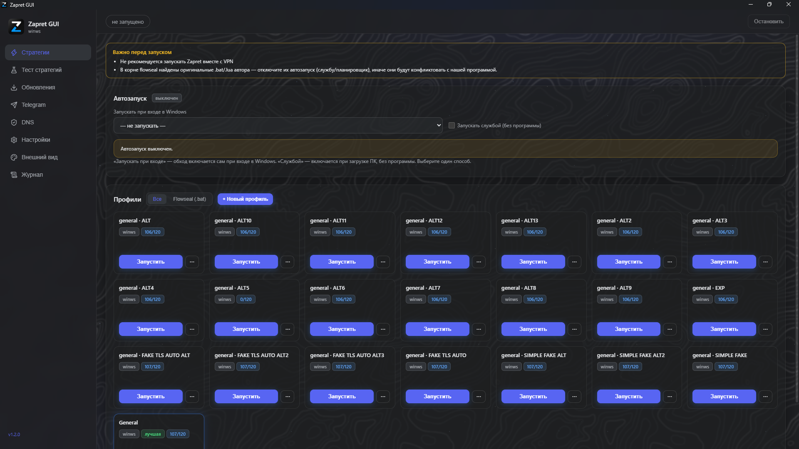
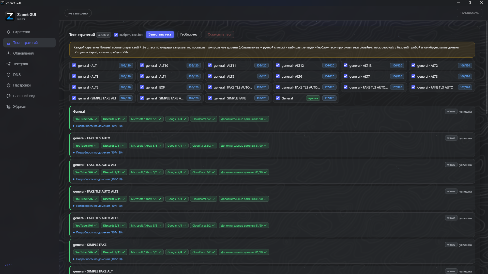

# Zapret GUI (Z GUI)

[](LICENSE)
[](#)

Портативная графическая оболочка для Windows к движку
[Flowseal / zapret-discord-youtube](https://github.com/Flowseal/zapret-discord-youtube) (winws).
Запуск и управление стратегиями, тест, обновления, защищённый DNS, Telegram-прокси — без
ручной правки `.bat` и консоли. Один `zgui.exe`, без установщиков: движок и стартовые
конфиги вшиты в файл, данные появляются рядом в папке `data/` при первом запуске.

> **Осторожно: фейки.** Не веду других страниц, групп и каналов в Telegram и YouTube.
> Если что-то распространяется от моего имени за пределами этой страницы GitHub — это фейк.
>
> **Не ищите сборки через Яндекс Поиск** — он часто выводит в первые ссылки вредоносы,
> а настоящий репозиторий прячет. Качайте только с этой страницы и сверяйте SHA-256
> (раздел «Проверка подлинности»).




## Отличия сборки

**Обновления по воздуху.** Стратегии, списки доменов и движок zapret обновляются из самой
программы. Не нужно следить за новыми релизами, заменять `.bat` вручную, скачивать движок
и прописывать его вручную: кнопка «Проверить обновления» делает всё сама, в фоне тоже
проверяет, а перед применением создаёт бэкап.

**Восстановление интернета.** Сломанный прокси или конфликт сети после запуска стратегий —
одна кнопка возвращает всё в рабочий вид, не трогая настройки провайдера и Wi-Fi.

## Что умеет

- **Стратегии**: списки профилей плитками, запуск/остановка, автозапуск при входе
  (через программу) или службой (без программы) — механизмы несовместимы, выбирается один.
- **Тест стратегий**: по очереди запускает `.bat`-стратегии и проверяет контрольные домены,
  выбирает лучшую; есть геоблок-тест по большому онлайн-списку.
- **Обновления**: одной кнопкой проверяются конфиги, движок и Telegram-мост; авто-проверка
  раз в N часов; всё применяется с бэкапами.
- **Защищённый DNS**: IPv4 + DoH провайдеры, «Тест пинга».
- **Telegram-прокси**: MTProto → WebSocket, «Подключить Telegram» одной кнопкой.
- **Журнал**: все действия и ошибки, кнопка «Сохранить отчёт» — присылайте его при проблемах.

## Быстрый старт

1. Скачайте `ZapretGUI-1.2.0-portable.zip` со [страницы релизов](releases) и распакуйте
   в папку без кириллицы и пробелов (например `D:\Zapret`).
2. Запустите `zgui.exe`. При первом запуске рядом появится `data/` — туда распакуется
   встроенный движок.
3. Требуется [WebView2 Runtime](https://go.microsoft.com/fwlink/p/?LinkId=2124703) —
   на актуальных Windows 10/11 уже установлен; для урезанных сборок и LTSC — по
   ссылке, бесплатно.
4. Для запуска стратегий и тестов нужны права администратора: включите
   «Всегда запускать программу от администратора» в «Настройках» (или подтверждайте запрос).

### Первый запуск: что вы увидите

- Файл не подписан, поэтому Windows может показать **SmartScreen**
  («Windows защитила ваш компьютер»). Это ожидаемо для портативных сборок:
  нажмите «Подробнее» → «Выполнить в любом случае». Как проверить, что файл настоящий, —
  в разделе «Проверка подлинности».
- При первом входе программа предложит «Всегда запускать от администратора»
  («Включить и перезапустить»). Это избавит от 5+ отдельных запросов прав на каждое
  действие — один перезапуск вместо них. Если отклонили («Не сейчас»),
  включить позже: «Настройки» → «Запуск от администратора».
- Если UAC недоступен (корпоративная политика, Limited User) — программа работает
  с ограничениями: просмотр, обновления конфигов; запуск движка и тесты потребуют прав.

## Обновления

Раздел «Обновления» проверяет и применяет обновления сам:

- **конфиги и списки** — каталог Flowseal (`general*.bat`, домены, ipset);
- **движок** — winws и WinDivert до актуального релиза;
- **Telegram-мост** — если используется `Подключить Telegram`.

Перед каждым применением создаётся резервная копия в `data/catalog/.backups`. Интервал
фоновой проверки задаётся в настройках обновлений.

## Восстановление интернета

В разделе «Настройки» → «Восстановление интернета»: снимает оставшиеся конфликты прокси,
сбрасывает состояние сети и кэш DNS. Настройки провайдера и Wi-Fi не трогаются. Если
стратегия оставила после себя неработающий интернет — начните с этой кнопки.

## Проверка подлинности

- Рядом с релизом публикуется `checksums.txt` с **SHA-256** файла `zgui.exe`.
- Проверить у себя (PowerShell):

  ```powershell
  Get-FileHash .\zgui.exe -Algorithm SHA256
  ```

  Хеш должен совпасть с указанным в `checksums.txt`.
- Исходники перед сборкой проверяются скриптом `scripts/security-check.ps1`: сверка хешей
  вшитых ресурсов, поиск подозрительных паттернов, аудит зависимостей (`cargo audit`,
  `npm audit`), скан Windows Defender.
- Скрипт `scripts/defender-test.ps1` проверяет, не мешает ли антивирус записи журнала и
  обновлению движка; инструкция — `docs/antivirus-test.md`.

## Антивирусы и WinDivert

**WinDivert** — драйвер перехвата и фильтрации трафика, необходимый для работы zapret.
Он может использоваться и хорошими, и вредоносными программами, но сам по себе вирусом
не является. Некоторые антивирусы относят такие файлы к классам «повышенного риска» или
хакерских инструментов и помещают в карантин; имя детекта всегда содержит WinDivert или
`Not-a-virus:RiskTool.Multi.WinDivert`. Это ожидаемое поведение, а не заражение.

Что делать: добавьте папку с программой в исключения антивируса либо отключите детект PUA
(потенциально нежелательных приложений). Например, в Kaspersky — галочка «Обнаруживать
легальные приложения, которые злоумышленники часто используют для нанесения вреда».
Если не до конца понимаете, что именно настраиваете, — просто отключите детект PUA.

*По материалам `README.md` репозитория [bol-van/zapret-win-bundle](https://github.com/bol-van/zapret-win-bundle).*

## Проблемы и отчёты

- Откройте **Issue на GitHub** — [сюда](issues). Если это невозможно — отчёт из программы.
- «Журнал» → **«Сохранить отчёт»** — файл `data/logs/отчёт-<дата>.txt` откроется в проводнике.
- В отчёте версия, система, состояние движка/службы/настроек и весь журнал — этого достаточно,
  чтобы понять причину.

## Поддержка

Проект бесплатный и открытый (MIT). Поставьте ⭐ этому репозиторию (кнопка сверху) — уже
помощь. Материальная поддержка — на добровольной основе:

[](https://www.donationalerts.com/r/lecl1ps3l)

Оригинальный движок zapret можно поддержать у его автора: [bol-van/zapret](https://github.com/bol-van/zapret).

## Благодарности

- Движок и стратегии — [Flowseal / zapret-discord-youtube](https://github.com/Flowseal/zapret-discord-youtube);
  ядро zapret — [bol-van](https://github.com/bol-van).
- Драйвер WinDivert — [Basil](https://github.com/basil00/divert) (LGPLv3).
- Иконки интерфейса — [Lucide Icons](https://github.com/lucide-icons/lucide) (ISC).
- Telegram-мост — [AmantesNihilo](https://github.com/AmantesNihilo/zapret-universal-interface) (MIT).
- Логотип приложения — собственная графика.

Идеи и референсы: Zapret Control Center ([lolososka](https://github.com/lolososka)),
ZapretControl ([Virenbar](https://github.com/Virenbar)), Line ([Read1dno](
https://github.com/Read1dno/Line)), FreeConnect ([cold-hell](https://github.com/cold-hell)).

Полный перечень сторонних компонентов и точные лицензии — `THIRD_PARTY_NOTICES.md`.

## Лицензия

Проект распространяется под **MIT** (см. `LICENSE`). Движок Flowseal и WinDivert
распространяются как есть, их лицензии — в `THIRD_PARTY_NOTICES.md`. История
изменений — `CHANGELOG.md`.