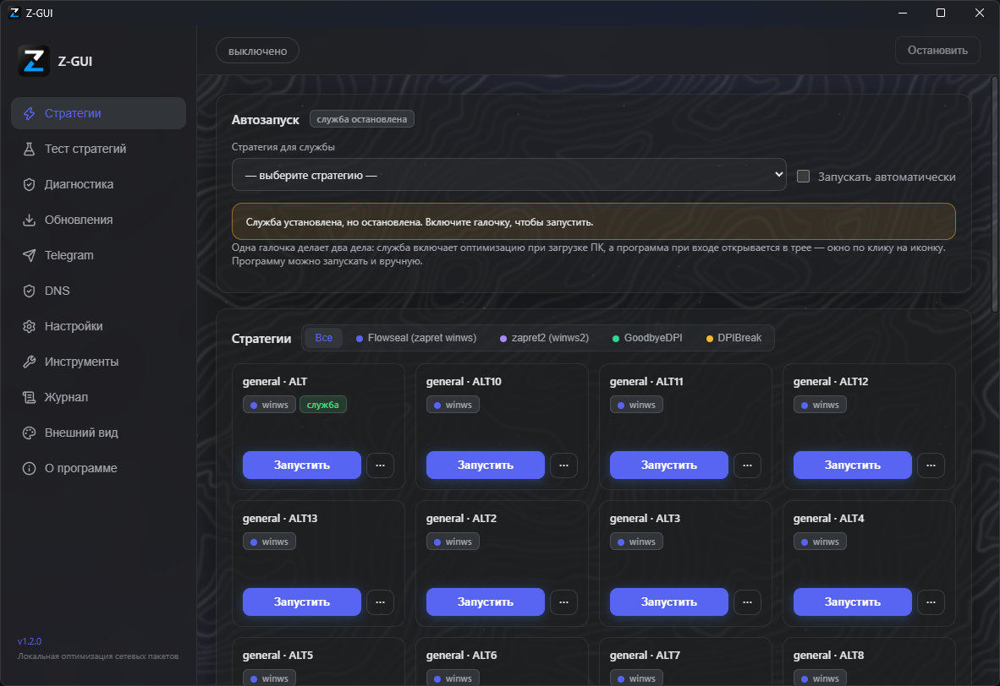

# Z-GUI


Портативная графическая оболочка для Windows к движкам локальной оптимизации трафика
([Flowseal / zapret-discord-youtube](https://github.com/Flowseal/zapret-discord-youtube),
[zapret2](https://github.com/bol-van/zapret2), [GoodbyeDPI](https://github.com/ValdikSS/GoodbyeDPI),
[DPIBreak](https://github.com/dilluti0n/DPIBreak)) — в одном окне, без правки `.bat` и консоли.

> ⚠️ **Не связано с Flowseal, bol-van, ValdikSS и dilluti0n.** Z-GUI — независимая оболочка; названия и товарные знаки движков принадлежат их владельцам.

## Что это

Z-GUI — портативная графическая оболочка для Windows к движкам локальной оптимизации трафика.
Программа, все четыре движка и стратегии лежат рядом в одной папке; первый запуск работает без
интернета. Всё выполняется локально, данные никуда не отправляются.

## Скриншоты

| Основная панель |
|---|
|  |

## Что умеет

| Возможность | Что делает |
|---|---|
| 🟢 Стратегии | Список профилей плитками, запуск/остановка, автозапуск службой |
| 🟢 Тест стратегий | По очереди проверяет стратегии по контрольным доменам и ранжирует их |
| 🟢 Диагностика | Помогает понять, почему сайт не открывается, и что с этим делать |
| 🟢 Обновления | Стратегии, списки и пресеты одной кнопкой, с бэкапом перед изменениями |
| 🟡 Защищённый DNS | Провайдеры IPv4 + DoH и «Тест пинга» |
| 🟡 Telegram-прокси | Подключение одной кнопкой |
| 🟡 Инструменты | Кэш Discord, обновление hosts, служебные файлы движка |
| 🟢 Журнал | Полный журнал действий и ошибок, отчёт одной кнопкой |
| 🟢 Обучение | Короткий интерактивный тур при первом запуске (повтор — в «Настройках») |

## Установка

1. Скачайте `Z-GUI Stable <версия>.zip` со [страницы релизов](https://github.com/lECL1PS3l/zgui/releases)
   и распакуйте в папку **без кириллицы и пробелов** (например `D:\Zapret`).
2. Запустите `zgui.exe`. Рядом уже есть папка `data/` — движки, стратегии и списки; первый запуск
   работает без интернета.
3. Нужен [WebView2 Runtime](https://go.microsoft.com/fwlink/p/?LinkId=2124703) — на актуальных
   Windows 10/11 уже установлен; если нет — см. FAQ.
4. Программа работает только от администратора. Заранее ничего включать не нужно: при первом
   запуске она один раз запросит права Windows и перезапустится.

**Проверка подлинности.** К каждому релизу приложен `checksums.txt` с **SHA-256** архива и `zgui.exe`:

```powershell
Get-FileHash .\zgui.exe -Algorithm SHA256
```

Качайте только с этой страницы: поисковики часто выводят на сборки с вредоносами.

## Приватность

- Никакой телеметрии и аналитики.
- Настройки хранятся только рядом с программой (`data/state.json`).
- Сеть используется только для GitHub (обновления, набор пресетов) и самих движков.
- Telegram-мост слушает только `127.0.0.1`.
- Права администратора нужны для системного драйвера и службы Windows.

## FAQ

<details>
<summary><b>Во время теста пропадает интернет — это нормально?</b></summary>

Да. Стратегия может кратковременно оборвать связь — вплоть до полного короткого обрыва. После
прогона программа возвращает прежнее состояние.
</details>

<details>
<summary><b>«Could not find the WebView2 Runtime»</b></summary>

Интерфейс рисует системный компонент WebView2. На LTSC, урезанных сборках и Windows Server его
может не быть. Установите один раз с <https://developer.microsoft.com/en-us/microsoft-edge/webview2>
и запустите программу заново.
</details>

<details>
<summary><b>SmartScreen предупреждает о файле</b></summary>

Сборка не подписана. Нажмите «Подробнее» → «Выполнить в любом случае» и сверьте SHA-256 из
`checksums.txt`.
</details>

<details>
<summary><b>Служба осталась после удаления программы / «WinDivert64.sys уже используется»</b></summary>

Служба `zapret` регистрируется в Windows, а не в папке программы. Перед удалением или переносом
папки снимите галочку «Включить службу». Если программа уже удалена — выполните от администратора:

```powershell
sc.exe stop zapret
sc.exe delete zapret
sc.exe stop windivert
sc.exe delete windivert
taskkill /F /IM winws.exe
```
</details>

<details>
<summary><b>Антивирус ругается на WinDivert</b></summary>

WinDivert — легитимный системный драйвер, который используется движком zapret; часть антивирусов
помечает его как risk-tool (`Not-a-virus:RiskTool.Multi.WinDivert`). Добавьте папку программы в
исключения либо отключите детект PUA.
</details>

<details>
<summary><b>Движок не помогает моему провайдеру</b></summary>

Всё зависит от провайдера. Если программа показывает, что дело в самом провайдере — локальная
обработка не поможет, нужен другой маршрут.
</details>

## Известные ограничения

- Только Windows 10 / 11, x64 (без 32-бит и ARM).
- Нужен WebView2 Runtime.
- Нужны права администратора (драйвер трафика и служба Windows).
- Обновления идут через GitHub; при заблокированном GitHub не обновятся.
- Поддерживаются только четыре встроенных движка.

## Разработка

- Стек: Rust (Tauri 2) и фронтенд на vanilla JS + Vite.
- Сборка: `npm install`, затем `powershell -File scripts\build.ps1` (программа должна быть закрыта).
- Тесты: `cargo test --lib` в `src-tauri/` и `cargo test` в `src-tauri/crates/tg-ws-proxy-rs`.
- Самопроверка безопасности: `powershell -File scripts\security-check.ps1`.
- О проблемах — через [issues](https://github.com/lECL1PS3l/zgui/issues) или «Журнал → Сохранить отчёт».

## Лицензия

**MIT** — см. [LICENSE](LICENSE). Полные указания сторонних компонентов и лицензии —
в [THIRD_PARTY_NOTICES.md](THIRD_PARTY_NOTICES.md); история изменений — в [CHANGELOG.md](CHANGELOG.md).

Благодарности: движки и стратегии — [Flowseal](https://github.com/Flowseal/zapret-discord-youtube),
[bol-van](https://github.com/bol-van/zapret2), [ValdikSS](https://github.com/ValdikSS/GoodbyeDPI),
[dilluti0n](https://github.com/dilluti0n/DPIBreak); WinDivert — [Basil](https://github.com/basil00/divert);
иконки — [Lucide](https://github.com/lucide-icons/lucide); узор «Topography» — Hero Patterns,
Steve Schoger.

[↑ Наверх](#z-gui)
