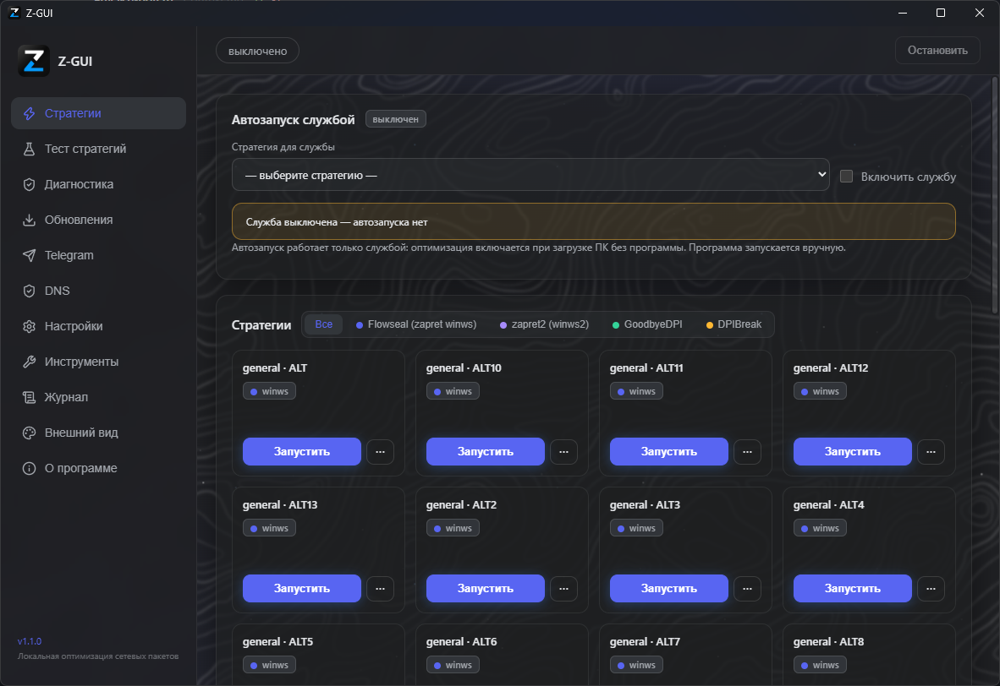

# Z-GUI

[](LICENSE)
[](#)
[](https://github.com/lECL1PS3l/zgui/releases/latest)

**[Скачать последнюю версию](https://github.com/lECL1PS3l/zgui/releases/latest)** — архив `Z-GUI Stable <версия>.zip`: распаковать и запустить `zgui.exe`.

Портативная графическая оболочка для Windows к движкам оптимизации трафика:
[Flowseal / zapret-discord-youtube](https://github.com/Flowseal/zapret-discord-youtube) (winws),
[zapret2](https://github.com/bol-van/zapret2) (winws2),
[GoodbyeDPI](https://github.com/ValdikSS/GoodbyeDPI) и
[DPIBreak](https://github.com/dilluti0n/DPIBreak).
Запуск и управление стратегиями, тест, обновления, защищённый DNS, Telegram-прокси — без
ручной правки `.bat` и консоли. Без установщиков: программа, все движки и стратегии лежат
рядом в одной папке, первый запуск работает без интернета.

> **Осторожно: фейки.** Не веду других страниц, групп и каналов в Telegram и YouTube.
> Если что-то распространяется от моего имени за пределами этой страницы GitHub — это фейк.
>
> **Не ищите сборки через Яндекс Поиск** — он часто выводит в первые ссылки вредоносы,
> а настоящий репозиторий прячет. Качайте только с этой страницы и сверяйте SHA-256
> (раздел «Проверка подлинности»).



## Отличия сборки

**Обновления по воздуху.** Стратегии и списки доменов обновляются из самой программы
(репозиторий Flowseal), набор пресетов — с наших релизов. Не нужно заменять `.bat`
вручную: кнопка «Проверить обновления» делает всё сама, в фоне тоже проверяет,
а перед применением создаёт бэкап. Новые версии движков выходят вместе со сборкой.

**Восстановление интернета.** Сломанный прокси или конфликт сети после запуска стратегий —
одна кнопка возвращает всё в рабочий вид, не трогая настройки провайдера и Wi-Fi.

## Что умеет

- **Стратегии**: списки профилей плитками, запуск/остановка, автозапуск службой
  (галочка на карточке «Автозапуск службой»; сама программа запускается вручную).
- **Тест стратегий**: по очереди запускает стратегии и проверяет контрольные домены,
  выбирает лучшую; результаты копятся в кэше и сравниваются по движкам.
- **Обновления**: одной кнопкой проверяются стратегии, списки, набор пресетов и
  Telegram-мост; авто-проверка раз в N часов; всё применяется с бэкапами.
- **Защищённый DNS**: IPv4 + DoH провайдеры, «Тест пинга».
- **Telegram-прокси**: MTProto → WebSocket, «Подключить Telegram» одной кнопкой.
- **Инструменты**: очистка кэша Discord, актуальные hosts, замена фейков; «О программе» —
  версии и лицензии.
- **Журнал**: все действия и ошибки, кнопка «Сохранить отчёт» — присылайте его при проблемах.

## Быстрый старт

1. Скачайте свежий архив `Z-GUI Stable <версия>.zip` со [страницы релизов](https://github.com/lECL1PS3l/zgui/releases) и распакуйте
   в папку без кириллицы и пробелов (например `D:\Zapret`).
2. Запустите `zgui.exe`. Рядом уже лежит папка `data/` — движки, стратегии и списки;
   первый запуск работает без интернета.
3. Требуется [WebView2 Runtime](https://go.microsoft.com/fwlink/p/?LinkId=2124703) —
   на актуальных Windows 10/11 уже установлен. Если его нет (LTSC, урезанные сборки,
   Windows Server) — появится ошибка «Could not find the WebView2 Runtime»; решение —
   в разделе «Известные проблемы».
4. Программа работает только от имени администратора. Заранее ничего включать не нужно:
   при первом запуске она сама запросит права Windows и перезапустится.

### Первый запуск: что вы увидите

- Файл не подписан, поэтому Windows может показать **SmartScreen**
  («Windows защитила ваш компьютер»). Это ожидаемо для портативных сборок:
  нажмите «Подробнее» → «Выполнить в любом случае». Как проверить, что файл настоящий, —
  в разделе «Проверка подлинности».
- Программа работает только с правами администратора: при первом запуске она сама
  запросит их (один запрос Windows) и перезапустится — подтвердите. Больше спрашивать не будет.
- Отказ от запроса прав (или недоступность UAC: корпоративная политика, Limited User)
  означает, что программа не запустится: появится окно с пояснением, и она закроется.

## Обновления

Раздел «Обновления» проверяет и применяет обновления сам:

- **стратегии и списки** — одним архивом из репозитория Flowseal (`.bat`, списки доменов, ipset);
- **набор пресетов** — с наших релизов (ассет `presets.json`);
- **Telegram-мост** — если используется `Подключить Telegram`.

Перед каждым применением создаётся резервная копия в `data/catalog/.backups`. Интервал
фоновой проверки задаётся в настройках обновлений. Новые версии движков выходят вместе
с новой сборкой программы — обновитесь, распаковав свежий zip.

## Восстановление интернета

В разделе «Настройки» → «Восстановление интернета»: снимает оставшиеся конфликты прокси,
сбрасывает состояние сети и кэш DNS. Настройки провайдера и Wi-Fi не трогаются. Если
стратегия оставила после себя неработающий интернет — начните с этой кнопки.

## Проверка подлинности

- Рядом с релизом публикуется `checksums.txt` с **SHA-256** архива и `zgui.exe`.
- Проверить у себя (PowerShell):

  ```powershell
  Get-FileHash .\zgui.exe -Algorithm SHA256
  ```

  Хеш должен совпасть с указанным в `checksums.txt`.
- Исходники перед сборкой проверяются скриптом `scripts/security-check.ps1`: аудит
  зависимостей (`cargo audit`, `npm audit`), поиск подозрительных паттернов,
  скан Windows Defender.
- Скрипт `scripts/defender-test.ps1` проверяет, не мешает ли антивирус записи журнала и
  запуску движка; инструкция — `docs/antivirus-test.md`.

## Антивирусы и WinDivert

**WinDivert** — драйвер перехвата и фильтрации трафика, необходимый для работы zapret.
Он может использоваться и хорошими, и вредоносными программами, но сам по себе вирусом
не является. Некоторые антивирусы относят такие файлы к классам «повышенного риска» или
хакерских инструментов и помещают в карантин; имя детекта всегда содержит WinDivert или
`Not-a-virus:RiskTool.Multi.WinDivert`. Это ожидаемое поведение, а не заражение.

Что делать: добавьте папку с программой в исключения антивируса либо отключите детект PUA
(потенциально нежелательных приложений). Например, в Kaspersky — галочка «Обнаруживать
легальные приложения, которые злоумышленники часто используют для нанесения вреда».
Если не до конца понимаете, что именно настраиваете, — просто отключите детект PUA.

*По материалам `README.md` репозитория [bol-van/zapret-win-bundle](https://github.com/bol-van/zapret-win-bundle).*

## Известные проблемы

### «Could not find the WebView2 Runtime» при запуске

Интерфейс программы рисуется системным компонентом **WebView2 Runtime** (на базе Edge).
На актуальных Windows 10/11 он уже установлен. Если его нет — Windows 10 LTSC/LTSB,
урезанные сборки, Windows Server, свежая установка без обновлений, или компонент стоит
только для другого пользователя, — программа не запустится и покажет такое окно.

Решение (один раз, около минуты):

1. Скачайте установщик с официальной страницы Microsoft:
   <https://developer.microsoft.com/en-us/microsoft-edge/webview2> (или напрямую —
   [запустить загрузку](https://go.microsoft.com/fwlink/p/?LinkId=2124703)).
2. Запустите его и дождитесь окончания (нужен интернет — докачивается актуальная версия).
3. Запустите `zgui.exe` заново.

Это не сбой программы и не заражение — системный компонент, которого нет в вашей сборке Windows.

### Служба осталась после удаления программы / «WinDivert64.sys уже используется»

Служба `zapret` регистрируется в самой Windows, а не в папке программы, и работает
независимо от окна: пока она запущена, файлы `winws.exe` и `WinDivert64.sys` заняты —
Windows не даёт их удалить или перенести. Удаление папки программу-службу не убирает:
запись остаётся в системе, и после перезагрузки Windows будет пытаться её запустить.

**Как правильно.** Перед удалением или переносом папки снимите галочку «Включить службу»
(она останавливает и удаляет службу), затем закрывайте программу. Галочка командует
именно службой (`Stop-Service` + `sc delete zapret`); драйвер WinDivert при этом не
трогается — программа сама снимает его, когда движков больше нет.

**Если программа уже удалена, а служба осталась** — выполните один раз от имени
администратора (PowerShell или cmd):

```powershell
sc.exe stop zapret
sc.exe delete zapret
sc.exe stop windivert
sc.exe delete windivert
taskkill /F /IM winws.exe
```

После этого папку и оставшиеся файлы можно удалить, а стратегию — запустить заново
(команда `taskkill` завершает только процесс движка; служба к этому моменту уже удалена).
`windivert` — системный драйвер перехвата трафика: он создаётся заново при следующем
запуске стратегии и снимается этими командами только если остался от застрявшей службы.

## Проблемы и отчёты

- Откройте **Issue на GitHub** — [сюда](https://github.com/lECL1PS3l/zgui/issues). Если это невозможно — отчёт из программы.
- «Журнал» → **«Сохранить отчёт»** — файл `data/logs/report-<дата>.txt` откроется в проводнике.
- В отчёте версия, система, состояние движка/службы/настроек и весь журнал — этого достаточно,
  чтобы понять причину.

## Поддержка

Проект бесплатный и открытый (MIT). Поставьте ⭐ этому репозиторию (кнопка сверху) — уже
помощь. Материальная поддержка — на добровольной основе:

[](https://www.donationalerts.com/r/lecl1ps3l)

Оригинальный движок zapret можно поддержать у его автора: [bol-van/zapret](https://github.com/bol-van/zapret).

## Благодарности

- Движки и стратегии — [Flowseal / zapret-discord-youtube](https://github.com/Flowseal/zapret-discord-youtube)
  (winws), [bol-van/zapret2](https://github.com/bol-van/zapret2) (winws2),
  [ValdikSS/GoodbyeDPI](https://github.com/ValdikSS/GoodbyeDPI),
  [dilluti0n/DPIBreak](https://github.com/dilluti0n/DPIBreak); ядро zapret — [bol-van](https://github.com/bol-van).
- Драйвер WinDivert — [Basil](https://github.com/basil00/divert) (LGPLv3).
- Иконки интерфейса — [Lucide Icons](https://github.com/lucide-icons/lucide) (ISC).
- Фоновый узор «Topography» — [Hero Patterns](https://heropatterns.com/), автор
  **Steve Schoger** (CC BY 4.0; спасибо за бесплатные паттерны).
- Telegram-мост — [AmantesNihilo](https://github.com/AmantesNihilo/zapret-universal-interface) (MIT).
- Логотип приложения — собственная графика.

Идеи и референсы: Zapret Control Center ([lolososka](https://github.com/lolososka)),
ZapretControl ([Virenbar](https://github.com/Virenbar)), Line ([Read1dno](
https://github.com/Read1dno/Line)), FreeConnect ([cold-hell](https://github.com/cold-hell)).

Полный перечень сторонних компонентов, точные лицензии и атрибуция —
`THIRD_PARTY_NOTICES.md` (на английском, чтобы авторам было читаемо).

## Лицензия

Проект распространяется под **MIT** (см. `LICENSE`). Движок Flowseal и WinDivert
распространяются как есть, их лицензии — в `THIRD_PARTY_NOTICES.md`. История
изменений — `CHANGELOG.md`.
